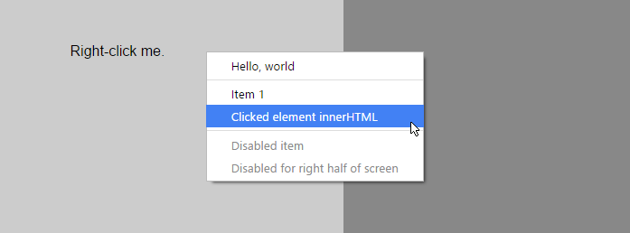
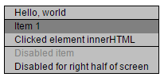

QuiContext
=====================
JS context menu library for modern browsers

Yet another useless library. Written for chrome extension, then decided to develop separately...
It's day will come, trust me. Eventually.

Features
---
 - Right-click element to get custom, GoogleChrome-looking context menu.
 - Context menus are defined in single place (not element-wise) 
 - Menus assignable by custom element attribute
 
Usage
---

### 1. Define the menu

First you have to define the menu. Each menu is a part of quicontext.menu object:

    quicontext.menu.demo_menu = [
        {title:'Hello, world',click:function(){alert('Hello, world!')}},
    ];
 
Each menu is an array, containing objects. Each object has several indexes:

 - `title` which contains menu title. This one is mandatory.
 - `click` which contains the function that should be called upon click. If this one is not set - 
 `quicontext.defaultClicker` will be called, which will output the menu item information to console. 
 - `disabled` (optional) which, if set to true, will make element disable. Also, if this is set to function returning
 true element will also be disabled.
 - `hidden` (optional) almost same as disabled, but this one will hide an element completely.
 - **Planned** `submenu` (optional) an array of menuitems in same format, which will be elements of child menu

### 2. Assign the menu to an element

Add an element with `context-menu` custom attribute and assign name of your menu (<strong>demo_menu</strong> in our case):

    
Right-click me.

    
Et voila. Upon click on that element your menu should appear. Child elements have higher priority than parent in this.

About callbacks
---

### Click

Click callbacks recieve 4 parameters: a **DOM element** for which the menu was fired (the element that was right-clicked),
a complete **object describing current menu**, an **index of menu item** that was clicked and the **click event**, that
was fired when menu item was clicked.

Skins and stuff
---
 
There are several skins.. Right now you have to compile them yourself, for which you will probably need
[less compiler](http://lesscss.org/):

    lessc less/quicontext.less quicontext.css
    
Skins are imported from that less file

    @import "skin_3ds";

And then you have to change the skin via line of js code:

    quicontext.skin = "3ds";

And voila:
    

Chrome skin is the default.

Under development
---
Do not rely on this yet, in future it will be changed.
 
Future plans
---
 - Nested menus (number one priority)
 - Icons (and sprites)
 - Maybe support for IE8 or something
 - URLs
 - Callbacks for everything
 - Keyboard shortcuts?
 - Check-functions for titles
 - Different styles for different browsers